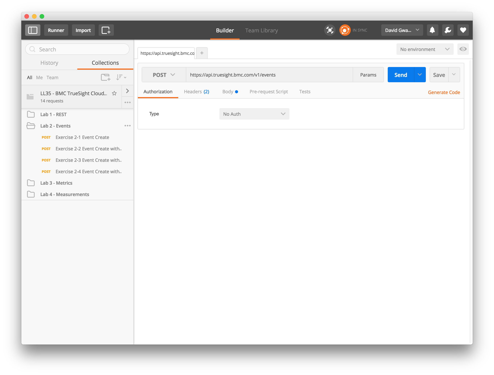
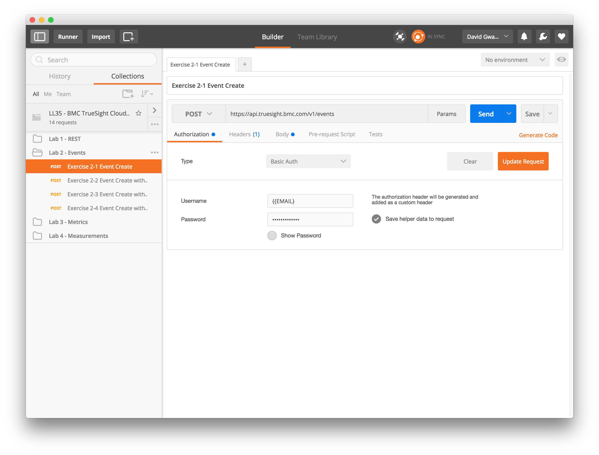
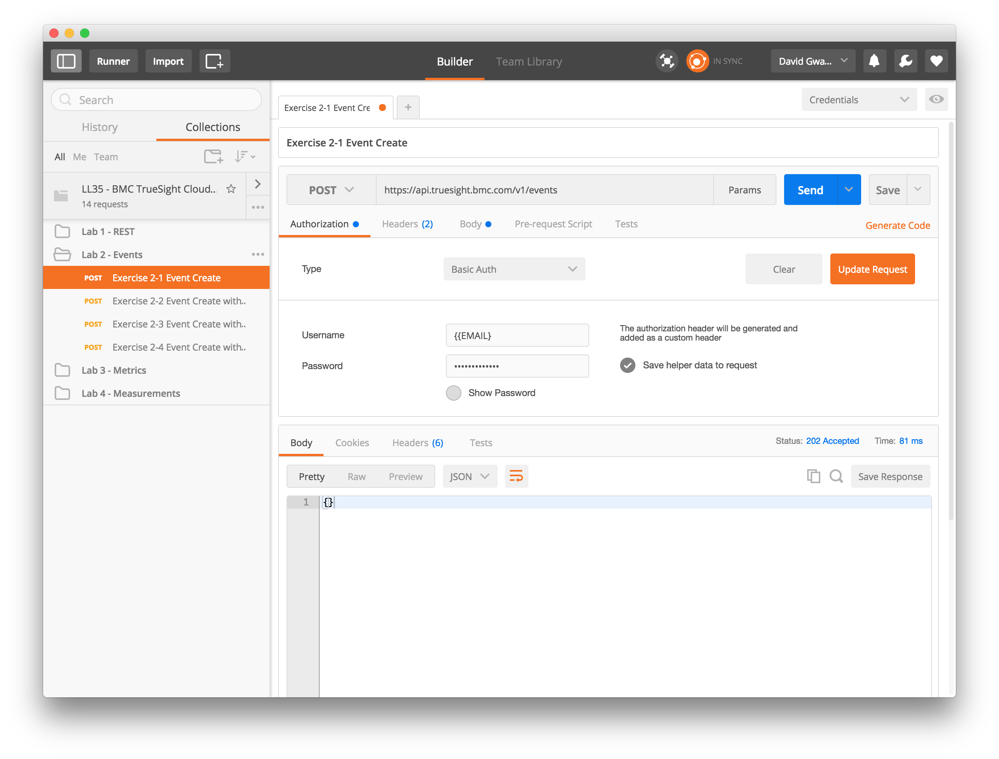
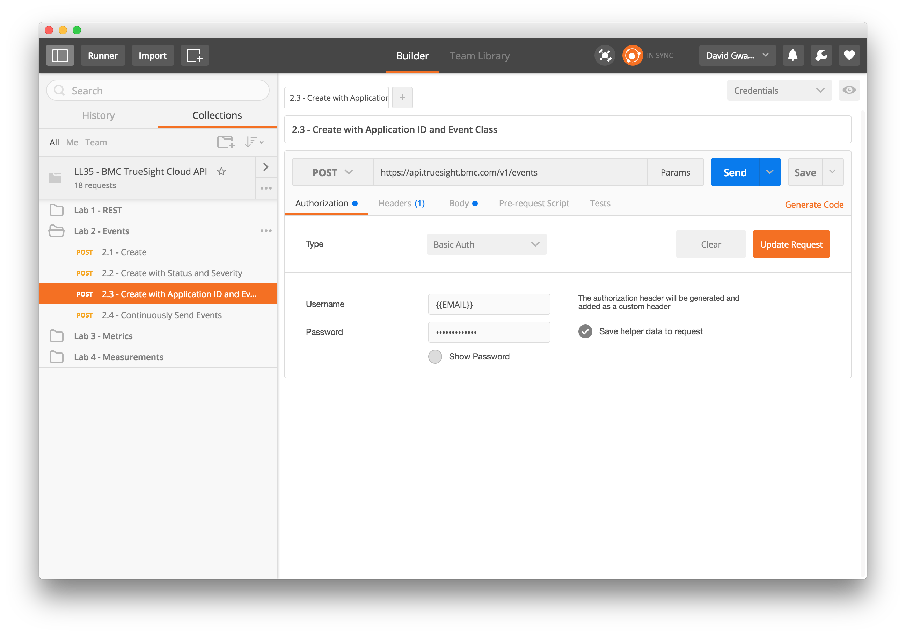
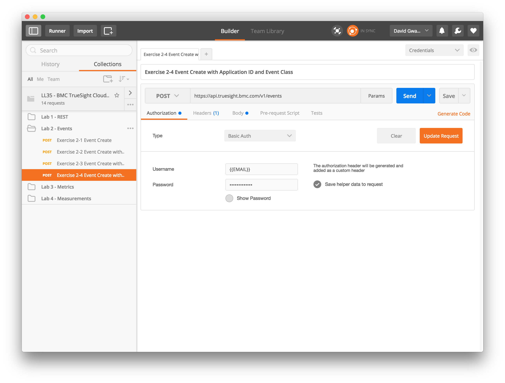

Lab 2 - Events API
==================

Agenda
------
- Overview slides of Event API
- Configure Authorization
- Run Labs

In the following labs will be generating events for display in TrueSight Intelligence
using the provide REST APIs

Configuring Authorization
-------------------------

### TrueSight Cloud API Authorization

The previous REST labs did not require authorization which is not the case with the TrueSight Cloud APIs.

Each participant was provided with an account which contains the e-mail and API token need to provide
authorization to execute REST API calls

#### Configuring Postman Environment

A Postman environment is means to parameterize inputs when making REST calls. This next procedure will
configure and environment so that you only need to provide your credentials once.

1. Launch the Postman application if not already running.

2. Click on the drop down menu in the upper right corner labeled _No environment_ and select
_Manage Environments_.

    

3. In the dialog that appears click on the _Import_ button.

    
    
4. Click on the button _Choose Files_:

    
    
5. Select the file `LL35-credentials.json` and click the _Open_ button:

    
    
6. Click on the link labeled _Credentials_:

    
    
7. Next to the _EMAIL_ type the e-mail for your account:

    
    
8. Next to the _API_TOKEN_ type the API Token for your account:

    
    
9. Click on the _Update_ button to save your e-mail and api token.

10. Dismiss the _Manage Environments_ dialog by clicking on the X in the upper right.

Lab Exercises
-------------

The following exercises will familiarize you with the event APIs.

### Getting Started

1. Open the Postman application if not already open.
2. Select the folder _Lab 2 - Events_

    

### Exercise 2.1 - Event Create

In this initial exercise we generate an event with the minimum number of inputs. The minimum pieces
of data to generate an event consists of:

- **title** - Short descriptive text about the event
- **fingerprint** - List of event fields that define _unique_ event instances.
- **source** - Originiation of the event. Typically

1. Click on _Exercise 2.1 Event Create_ in the folder _Lab 2 - Events_

    
    
2. Click on the _body_ tab to view the JSON document that contains the minimum required fields to create an event

    
    
3. Click on the _Authorization_ tab:

    
    
4. Click on the _Update Request_ button to add the authorization header to the request from the _credentials_
environment previously configured.
    
5. Click the _Send_ button:

    
    
6. To observe the event in TrueSight Intelligence navigate to:
[https://truesight.bmc.com/intelligence/#/events/list](https://truesight.bmc.com/intelligence/#/events/list)
and use your credentials to login.

7. In the event list you can see the generated event:

    
    
8. Observe that _Title_ and the _Source_ that which was included in the JSON document occupies
the _Title_ and _Source Ref_ respectively. The _Status_,  _Type_, and _Severity_ are not known since they were not specified.

9. Also of note is the status code returned is 202 rather than typical.

### Exercise 2.2 - Event Create with Message and Status

1. Click on _Exercise 2-2 Event Create with Message and Status_ from _Lab 2 - Events_
2. Click on _Send_ button

### Exercise 2.3 - Event Create with Event Class

1. Click on _Exercise 2.3 Event Create with Event Class_
2. Click on _Send_ button

### Exercise 2.4 - Continuously Send Events

1. Launch _Runner_
2. Click on _TrueSight Intelligence API Lab -> Events_ button
3. Set _Iteration_ to the number of events to send
4. Set _Dely_ to number of milli-seconds between events
5. Click on _Start Test_ to send a continuous flow of events

