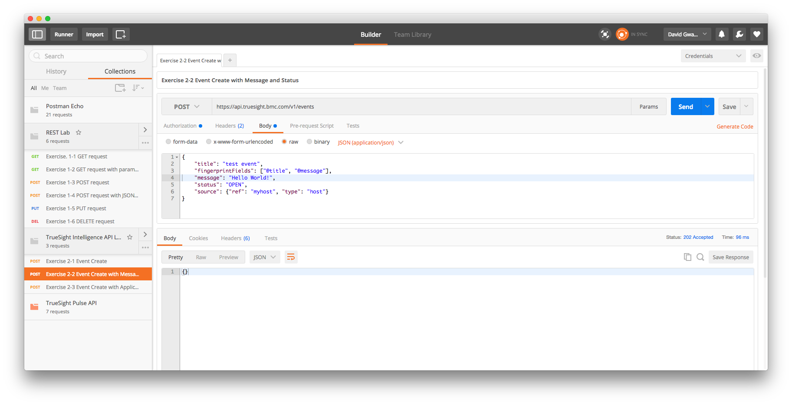
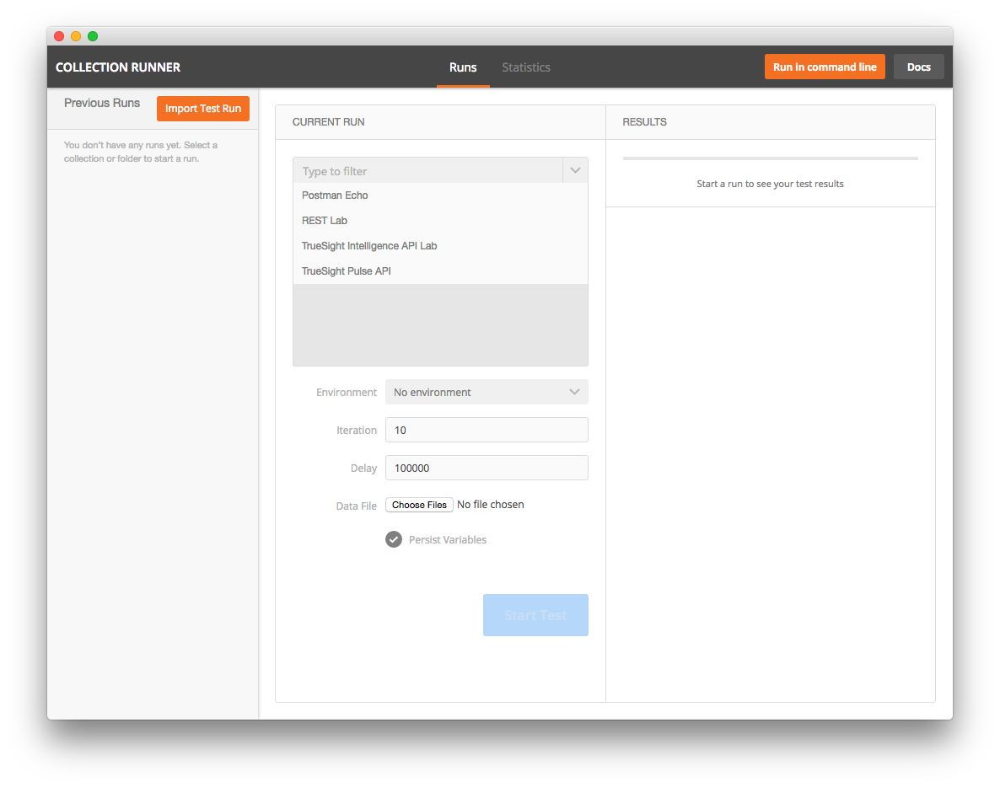

Lab 2 - Events API
==================

Agenda
------
- Overview slides of Event API
- Run Labs

Lab Exercises
-------------

### Exercise 2.1 - Event Create

1. Click on _Exercise 2.1_
2. Click on _Send_ button

### Exercise 2.2 - Event Create with Message and Status

1. Click on _Exercise 2.2_
2. Click on _Send_ button

### Exercise 2.3 - Event Create with Event Class

1. Click on _Exercise 2.3_
2. Click on _Send_ button

### Exercise 2.4 - Continuously Send Events

1. Launch _Runner_
2. Click on _TrueSight Intelligence API Lab -> Events_ button
3. Set _Iteration_ to the number of events to send
4. Set _Dely_ to number of milli-seconds between events
5. Click on _Start Test_ to send a continuous flow of events

