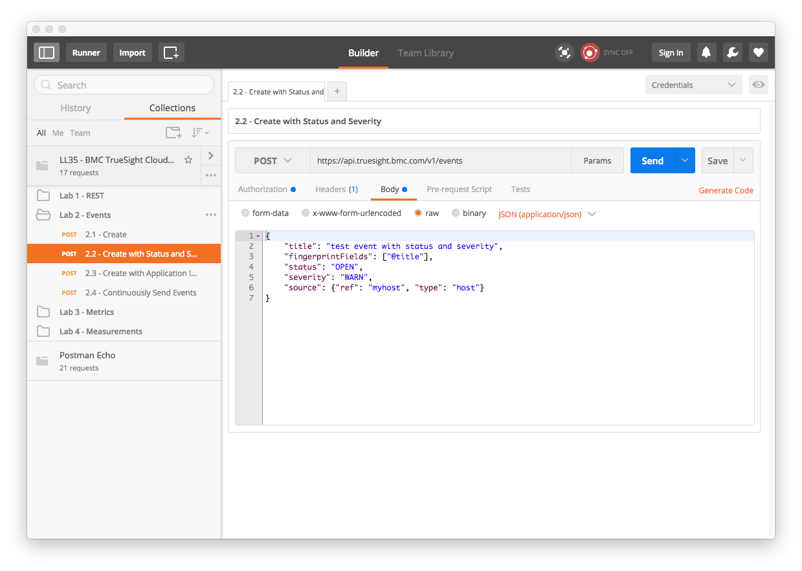
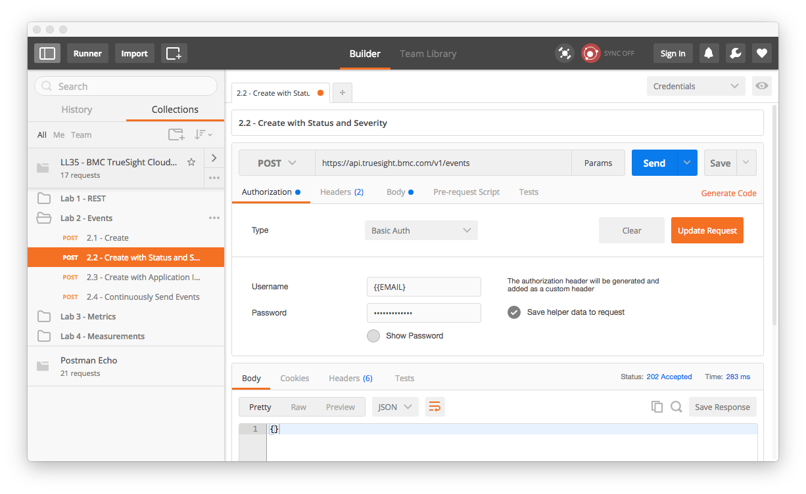

Lab 2 - Events API
==================

Agenda
------
- [TSI API Documentation](https://documentation.truesight.bmc.com/overview)
- Run Labs

In the following labs will be generating events for display in TrueSight Intelligence
using the provide REST APIs

Lab Exercises
-------------

The following exercises will introduce you to the event APIs.

### Getting Started

1. Open the Postman application if not already open.
2. Select the folder _Lab 2 - Events_
    

### Exercise 2.1 - Event Create

In this initial exercise we generate an event with the minimum number of inputs. The minimum pieces
of data to generate an event consists of:

- **title** - Short descriptive text about the event
- **fingerprint** - List of event fields that define _unique_ event instances.
- **source** - Originiation of the event. Typically the hostname or ip address in which this event refers.

1. Click on _2.1 Event Create_ in the folder _Lab 2 - Events_
    
2. Click on the _body_ tab to view the JSON document that contains the minimum required fields to create an event:
    
3. Click on the _Authorization_ tab:
    
4. Click on the _Update Request_ button to add the authorization header to the request from the _credentials_
environment previously configured.
    
5. Click the _Send_ button:
    
6. To observe the event in TrueSight Intelligence navigate to:
[https://truesight.bmc.com/intelligence/#/events/list](https://truesight.bmc.com/intelligence/#/events/list)
and use your credentials to login.
7. In the event list you can see the generated event:
    
8. Observe that _Title_ and the _Source_ that which was included in the JSON document occupies
the _Title_ and _Source Ref_ respectively. The _Status_,  _Type_, and _Severity_ are not known since they were not specified.
9. Also of note is the status code returned is 202 rather than the typical 200.
### Exercise 2.2 - Event Create with Status and Severity
Each event instance has an associated status and severity which provide additional state information about the event.

Status and severity are free form text values which can take on any desired values.

Typical values for Status are:

- `OPEN`
- `CLOSED`
- `ACKNOWLEDGED`
- `OK`

When an event is marked as `CLOSED` further matching raw events will result in new events.

Typical values for Severity are:

- `INFO`
- `WARN`
- `ERROR`
- `CRITICAL`

1. Click on _2.2 - Create with Status and Severity_ from folder _Lab 2 - Events_
    
2. Click on the _body_ tab to view the contents of the JSON document:
    
3. Click on the _Authorization_ tab:
    
4. Click on the _Update Request_ button to add the authorization header to the request from the _credentials_
environment previously configured.
5. Click on _Send_ button and observe the output:
    
6. View event in event list:
    

### Exercise 2.3 - Event Create with Application Id and Event Class

Two additional fields `Application Id` and `Event Class` are used to populate the _App_ and _Type_ fields
in the event display respectively.

App and Type provide additional means to filter to specific set of events.

1. Click on _2.3 - Create with Application ID and Event Class_ from folder _Lab 2- Events_
    
2. Click on the _body_ tab to view the contents of the JSON document:
    
3. Update the authorization header as done in previous exercises.
4. Click on _Send_ button
    

### Exercise 2.4 - Continuously Send Events

1. Launch _Runner_ button in the upper right corner of the browser window:
    
2. Under current run select _Lab 2 - Events_.
    
3. From the environment drop down select _credentials_.
    
4. Set _Iteration_ to the number of times to send:
    
5. Set _Delay_ to number of milli-seconds between events
    
6. Click on _Start Test_ to send a continuous flow of events
    
7. Click on _TrueSight Intelligence API Lab -> Events_ button
8. To observe the event in TrueSight Intelligence navigate to:
[https://truesight.bmc.com/intelligence/#/events/list](https://truesight.bmc.com/intelligence/#/events/list)
and use your credentials to login.
    
    
Lab 2 Summary
-------------

In this lab we learned how to sent events and view them in TrueSight Intelligence.

We created events with Application Ids and specified Event Class so we can apply additional filtering in the
event display in TrueSight Intelligence.
    

****

