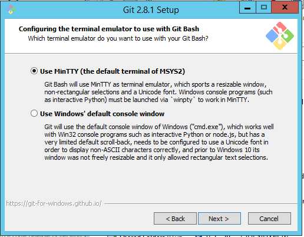

Laptop Computer Requirements
============================

Prerequisites and Requirements
-----------------------------

### Prerequisites

1. TSI account for each laptop.
2. AWS EC2 t2.micro instance spun up for each laptop.

### Hardware

1. Minimum 4gb memory or greater
2. Network access to Internet

### Software

1. Windows 7 or later
2. Google Chrome Browser, version 51.0.2704.106 or later
3. Postman Chrome App
4. Curl version 7.46 or later
5. Putty version 0.67 or later
5. 64bit Git for Windows 2.8.1 or later and install per instructions provided (see below for details)

Git For Windows Installation Instructions
-----------------------------------------

When using the Git installer make sure you select the options in the installation shown in the next sections.

### Adjusting your PATH environment

### Configure the line ending conversions

### Configure the terminal emulator to use with Git Bash

****
