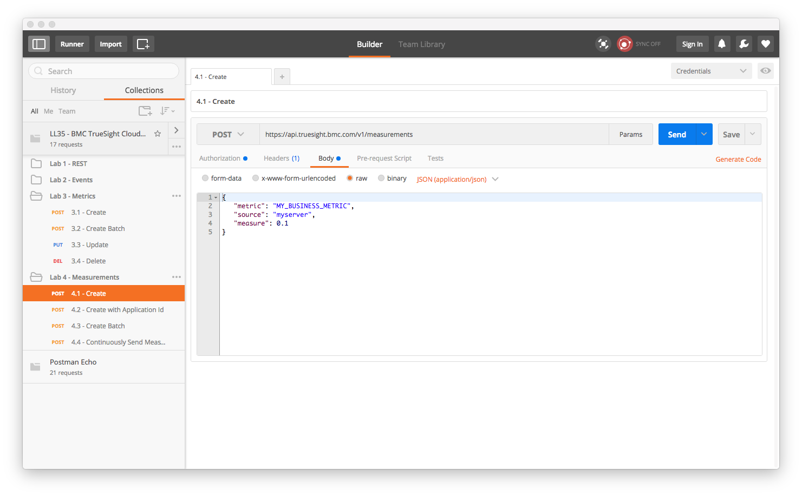
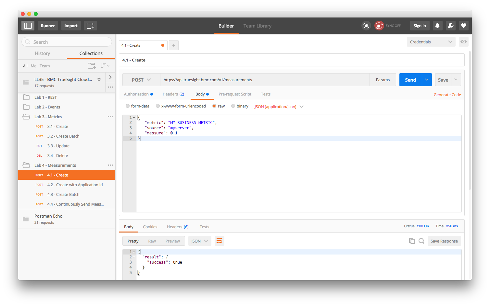
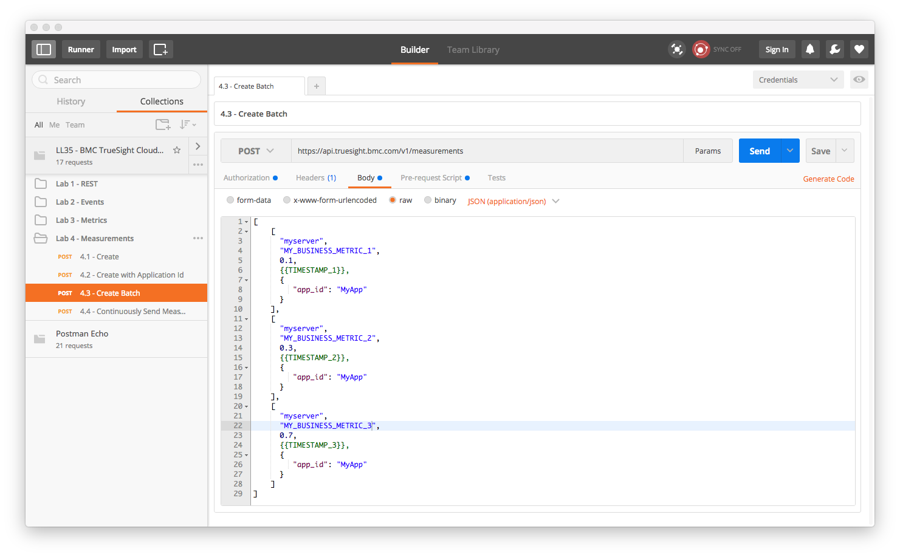

Lab 4 - Measurement API
=======================

Agenda
------
- Overview slides of Measurement API
- Run Labs

Measurements
------------

A _measurement_ is a specific instance of a time series data point that references a _metric_.

A measurement consists of four attributes:

- **Metric** - Identifier of the metric that this measurement is about
- **Measure**  - Value of the time series
- **Timestamp** - Occurrence of the time series value
- **Source** - Label that identifies the specific instance the time series data point is about

### Getting Started

1. Open the Postman application if not already open.
2. Select the folder _Lab 3 - Measurements_
    
3. Ensure that the _Credentials_ item is selected in the _Manage Environments_ drop down menu.

### Exercise 4.1 - Measurement Create

This exercise shows how to create a single measurement

1. Click on _4.1 Create_ in the folder _Lab 4 - Measurements_
    
2. Click on the _Body_ tab to display the contents of the JSON document:
    
3. Observe the 3 different fields in the document: `metric` indicating the metric identifier,
`measure` indicating the time series value, and lastly the source. The `timestamp` in this
case will be come the receipt time at the API endpoint
4. Click the _Send_ button to create the measurement:
    
    
    
### Exercise 4.2 - Measurement Create with Application Id

1. Click on _4.2 Create with Application Id_ in the folder _Lab 4 - Measurements_
    
2. Click on the _Body_ tab to display the contents of the JSON document:
    
3. Observe the additional field `metadata` in the JSON document that contains the property
`app_id` which contains the application id.
4. Click the _Send_ button to create the measurement:
    
    
### Exercise 4.3 - Measurement Create Batch

This exercise shows how to create multiple measurements in a single call.

1. Click on _4.3 Create Batch_ in the folder _Lab 4 - Measurements_
    
2. Click on the _Body_ tab to display the contents of the JSON document:
    
3. Observe the array of measurements in the JSON document
4. Click the _Send_ button to create the measurements:
    

****
