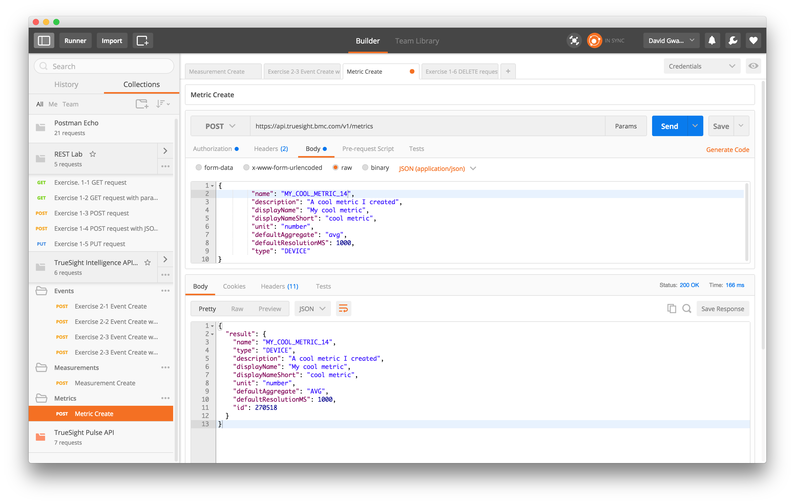
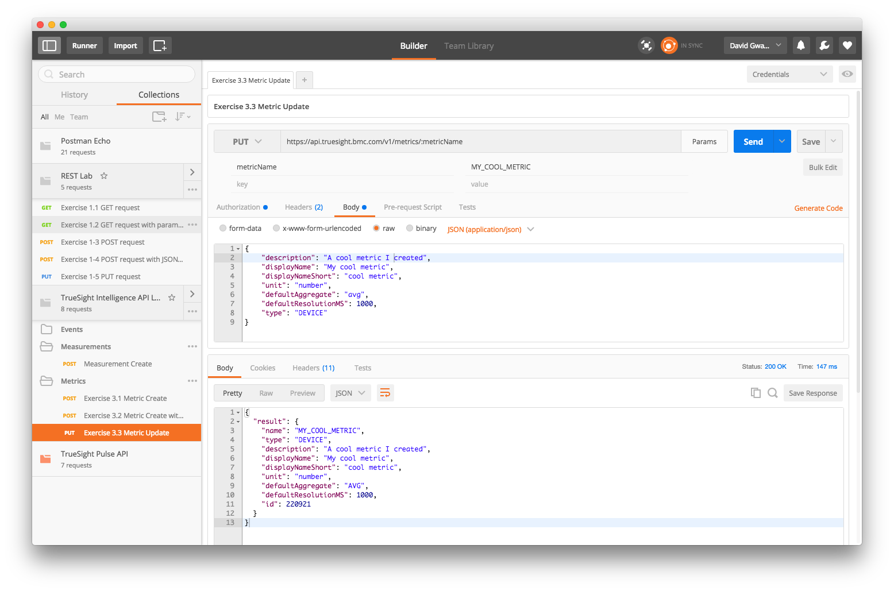

Lab 3 - Metric API
==================

Agenda
------
- Overview slides of Metric API
- Run Labs

Lab Exercises
-------------

### Exercise 3.1 - Metric Create

1. Click on _Exercise 3.1 Metric Create_
2. Click on _Send_ button

### Exercise 3.2 - Metric Create with Type

1. Click on _Exercise 3.1 Metric Create with Type_
2. Click on _Send_ button

### Exercise 3.3 - Metric Update

1. Click on _Exercise 3.3 Metric Update_
2. Click on _Send_ button

