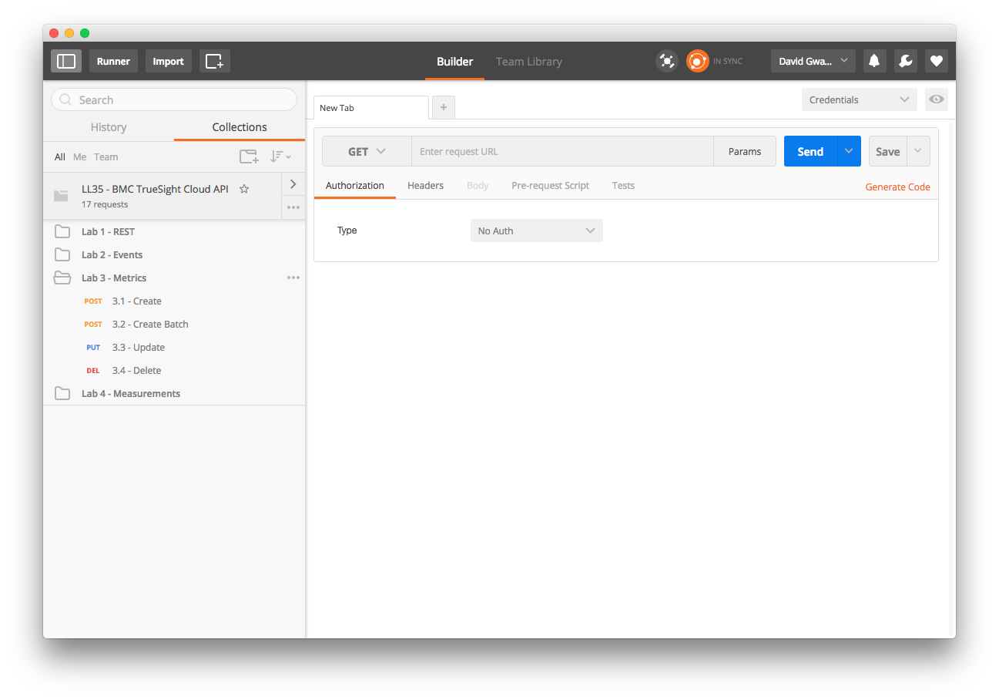
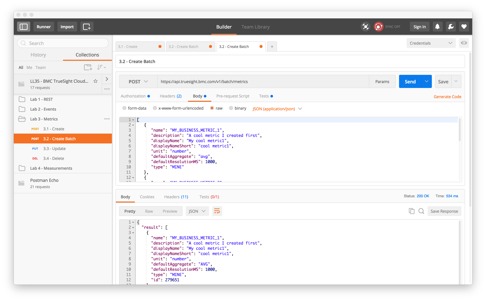
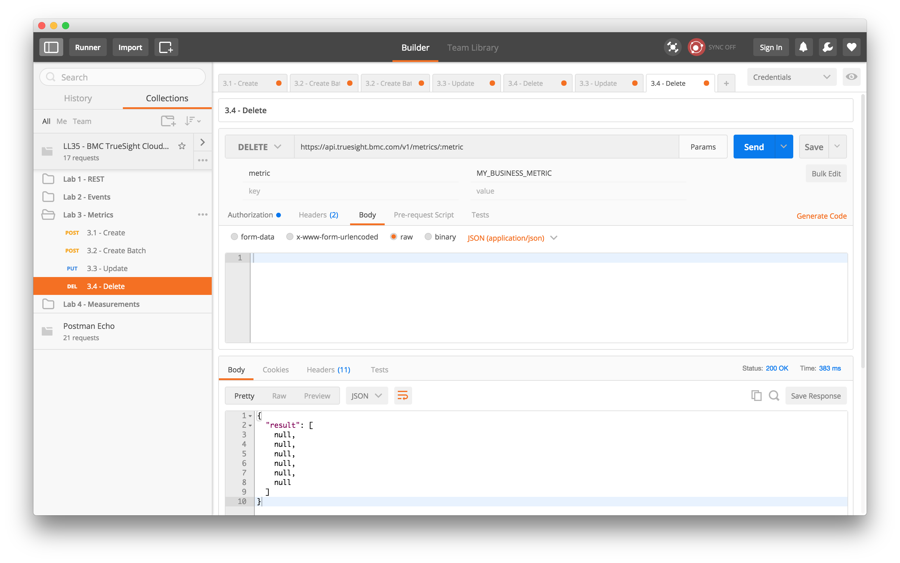

Lab 3 - Metric API
==================

Agenda
------
- Overview slides of Metric API
- Run Labs

Metrics
-------

A _metric_ defines metadata about _measurements_(time series data) input to the TrueSight Pulse/Intelligence. Metadata
is used control how and what data is displayed in graphs and other UI components.

A metric definition consists of the following attributes:

- **Name** - Identifier or primary key that uniquely defines the metric definition
- **Display Name** - Label used within the web interface.
- **Short Display Name** - Shortened label used with the web interface.
- **Description** - Text that describes the metric.
- **Default Aggregate** - Type of aggregate displayed by default. An enumeration with the followin values: 
`avg`, `min`, `max`, and `sum`
- **Unit** - Quantity measured by this metric. An enumeration with the following values: `bytecount`,
`duration`, `number`, and `percent`
- **Default Resolution** - Expected frequency of measurement update
- **Type** - 

Lab Exercises
-------------

### Getting Started

1. Open the Postman application if not already open.
2. Select the folder _Lab 2 - Metrics_

    
    
3. Ensure that the _Credentials_ item is selected in the _Manage Environments_ drop down menu.
    
### Exercise 3.1 - Metric Create

This exercise shows how to create a single metric defintion.

1. Click on _3.1 Create_ in the folder _Lab 3 - Metrics_

    

2. Click on the _Body_ tab to display the contents of the JSON document:

    
    
3. Click the send _Send_ button to create the metric definition:

    

### Exercise 3.2 - Metric Create Batch

This exercise shows how to create multiple metric definitions with a single REST call

1. Click on _3.2 Create Batch_ in the folder _Lab 3 - Metrics_

    
    
2. Click on the _Body_ tab to display the contents of the JSON document:

    
    
3. Click the send _Send_ button to create the metric definitions:

    

### Exercise 3.3 - Metric Update

1. Click on _3.3 Update_ in the folder _Lab 3 - Metrics_

    
    
2. Click on the _Params_ button to the right of the _URL_:

    
    
3. Observe the `metric` parameter is set to the name of the metric create in the first metric exercise this is the
metric to be updated:

4. Click on the _Body_ tab to display the contents of the JSON document:

    

5. Click the _Send_ button to update the metric definition:

    

### Exercise 3.4 - Metric Delete

1. Click on _3.4 Delete_ in the folder _Lab 3 - Metrics_

    
    
2. Click on the _Params_ button to the right of the _URL_:

    
    
3. Observe the `metric` parameter is set to the name of the metric create in the first metric exercise this is the
metric to be deleted:
    
4. Click the _Send_ button to delete the metric

    
    
    
Lab 3 Summary
-------------

In this lab we complete several exercises to create, update, and remove metrics. Metrics are definitions that contain
metadata that control how graphs are displayed.

