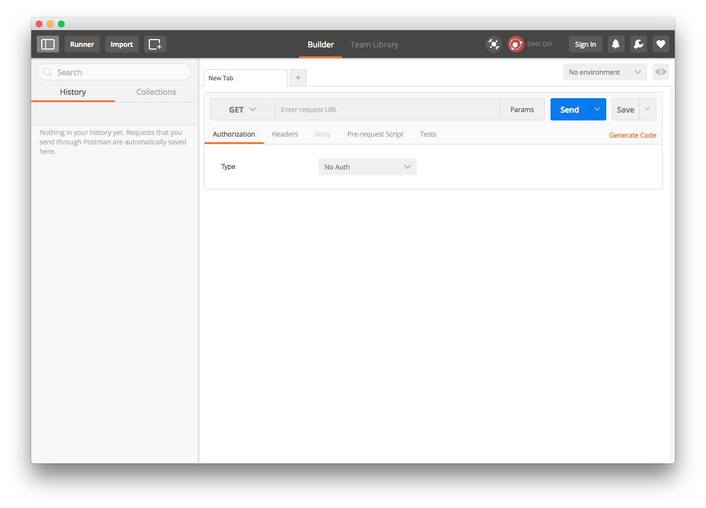
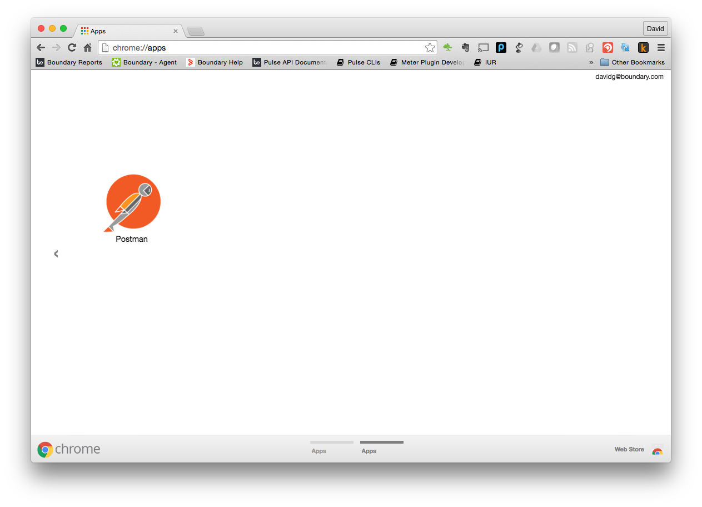
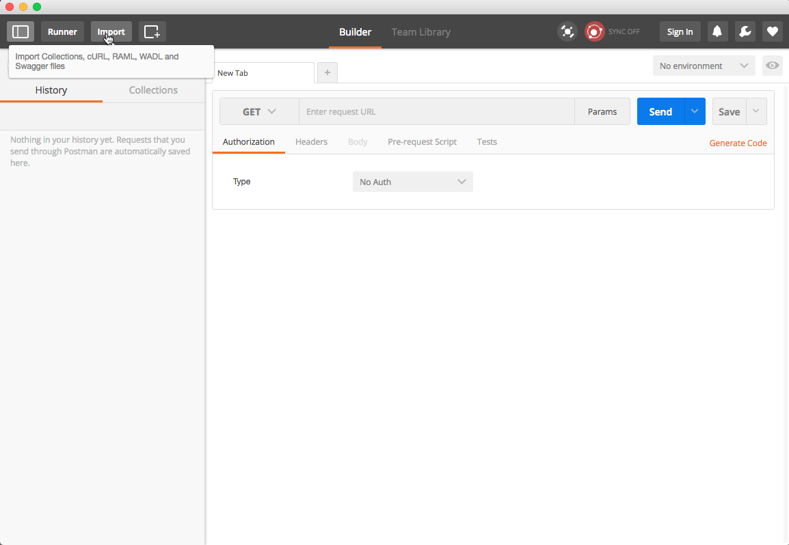
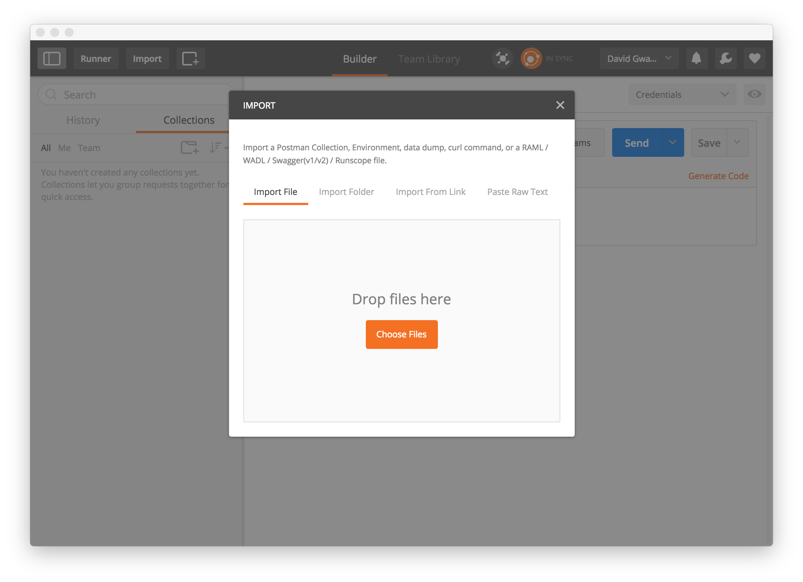
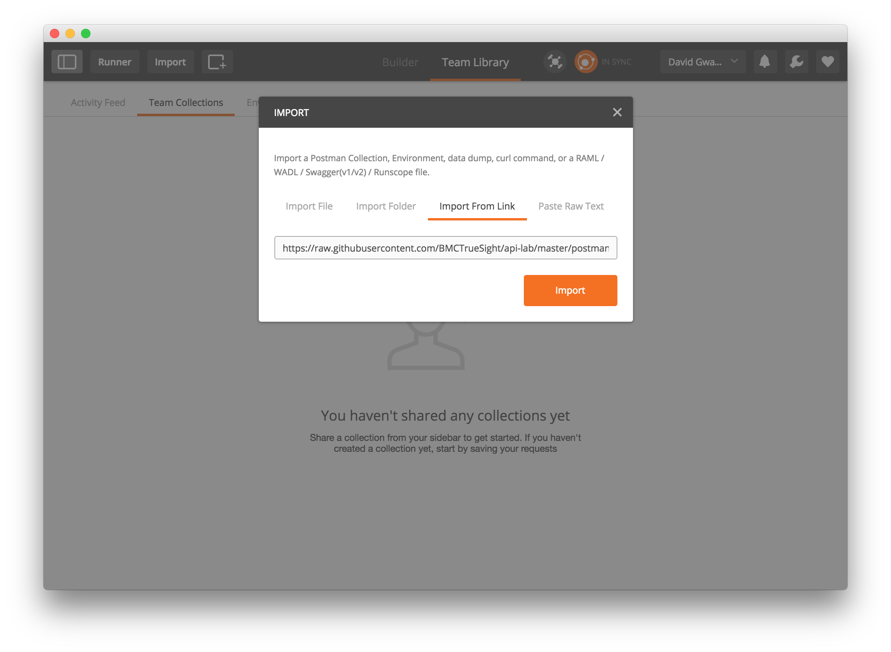
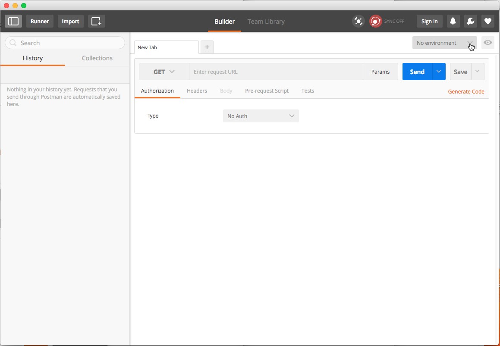
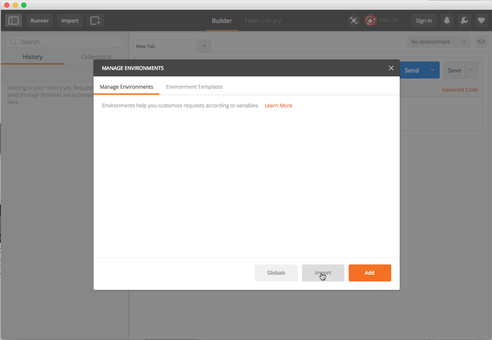
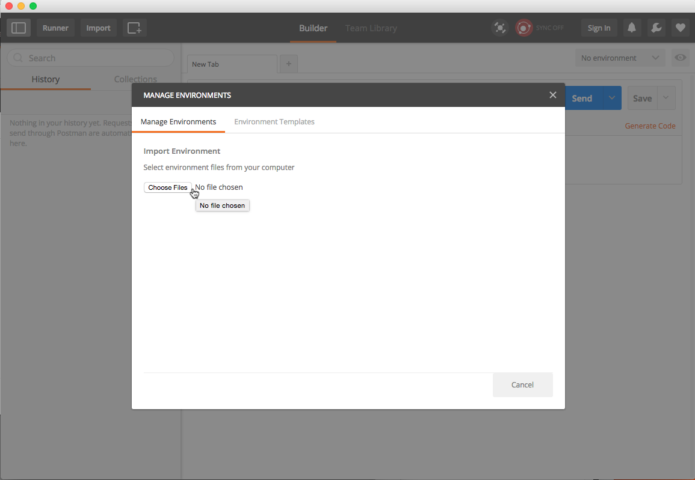
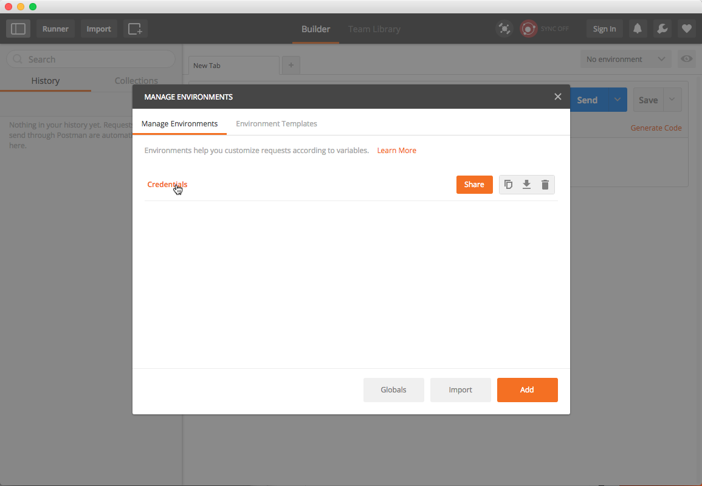
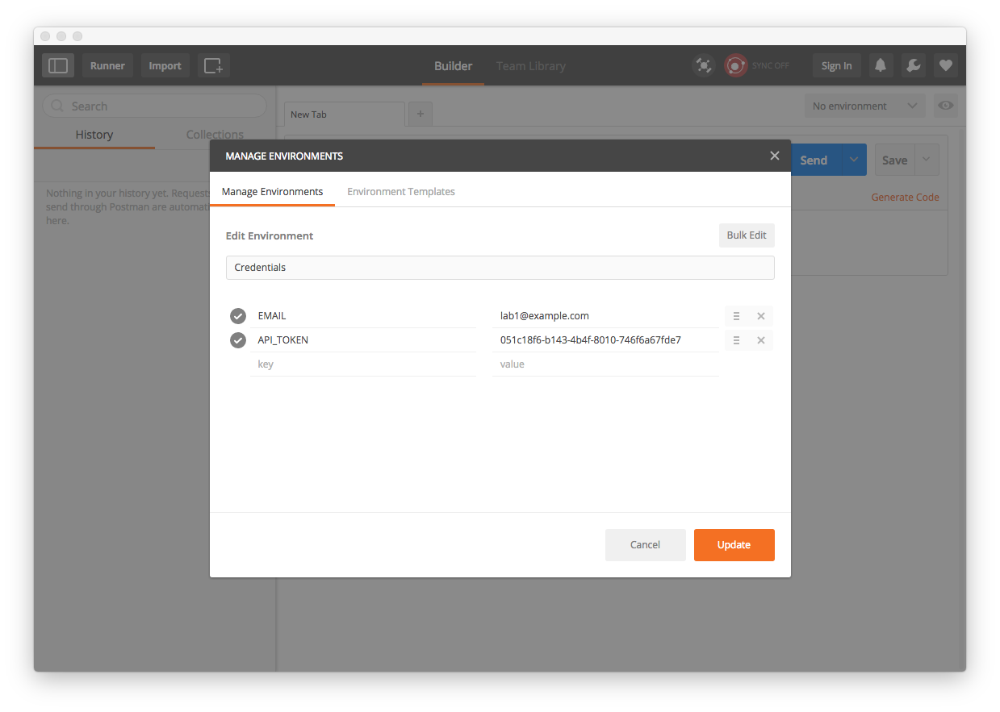

Postman Installation and Configuration
======================================

This lab and proceeding labs use the PostMan Chrome application for executing REST commands.

The chrome plugin and the lab material are required to be loaded to complete any of the labs that
follow through out this course.

Installation
------------

1. Launch Chrome browser
2. Install Postman by clicking on or cutting and pasting the following link in your Chrome browswer: [https://chrome.google.com/webstore/detail/postman/fhbjgbiflinjbdggehcddcbncdddomop?hl=en](https://chrome.google.com/webstore/detail/postman/fhbjgbiflinjbdggehcddcbncdddomop?hl=en)
    
3. Click on the button labeled, _+ ADD TO CHROME_, to install the Postman Chrome application.
4. In the pop-up dialog click on the button labeled, _Add app_.
    
5. Installation of Postman is then complete:
    
6. Bypass signing up for an account by clicking the link _Skip this, go straight to the app_.
    
7. Which displays the Postman Chrome application:
    

Importing Lab Exercises
-----------------------

1. Launch Chrome Browser
2. Type the following URI into the browser address bar: `chrome://apps`.
3. Click on the Postman icon as shown here:
    
4. Click on the _Import_ button which displays a pop-up window:
    
5. Which displays a pop-up window:
    
6. Click on the _Import From Link_:
    
7. Cut and paste this [link](https://raw.githubusercontent.com/BMCTrueSight/api-lab/master/postman/LL35-lab.json) into the URL field
    
8. Click the _Import_ button to load the collection.
    
    
TrueSight Cloud API Authorization
-------------------------------------

The previous REST labs did not require authorization which is not the case with the TrueSight Cloud APIs.

Each participant was provided with an account which contains the e-mail and API token needed to provide
authorization to execute REST API calls

### Configuring Postman Environment

A Postman _environment_ is means to parameterize inputs when making REST calls. This next procedure will
configure an environment so that you only need to provide your credentials once.

1. Launch the Postman application if not already running.
2. Click on the drop down menu in the upper right corner labeled _No environment_ and select
_Manage Environments_.
    
3. The following pop-window is displayed:
    
4. Click on the _Import_ button.
    
5. Click on the button _Choose Files_:
    
6. Select the file `LL35-environment.json` and click the _Open_ button:
    
7. Click on the link labeled _Credentials_:
    
8. Next to the _EMAIL_ type the e-mail for your account:
    
9. Next to the _API_TOKEN_ type the API Token for your account:
    
10. Click on the _Update_ button to save your e-mail and api token.
    
11. Dismiss the _Manage Environments_ dialog by clicking on the X in the upper right.
    
12. Select the _Credentials_ environment by selecting _Credentials_ in the upper right drop down menu.
    

