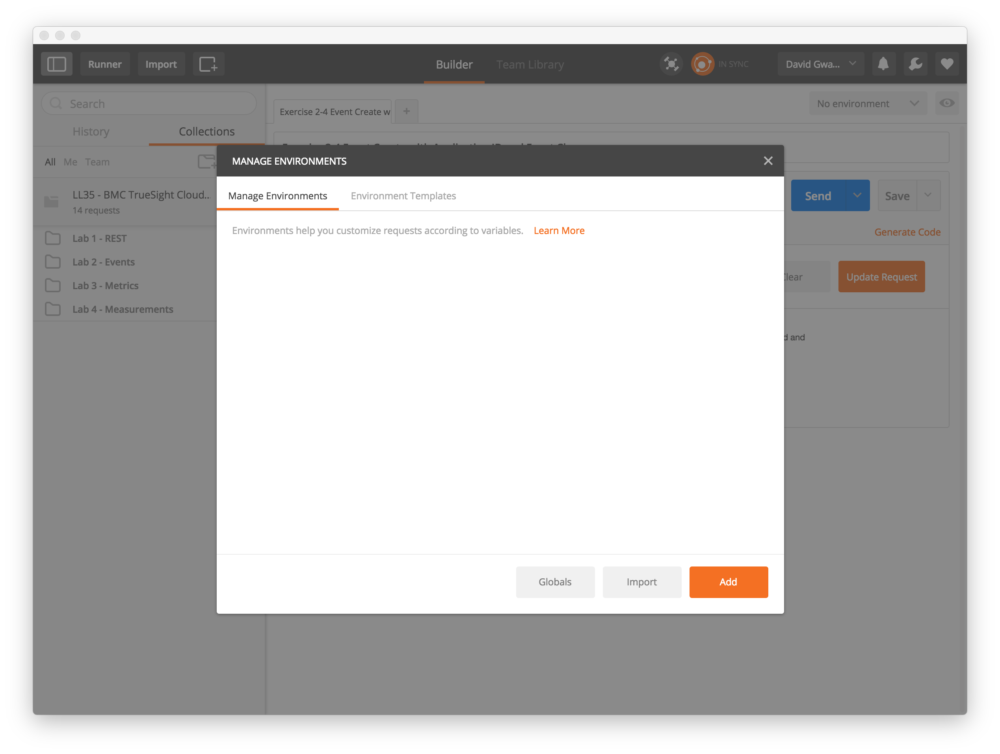
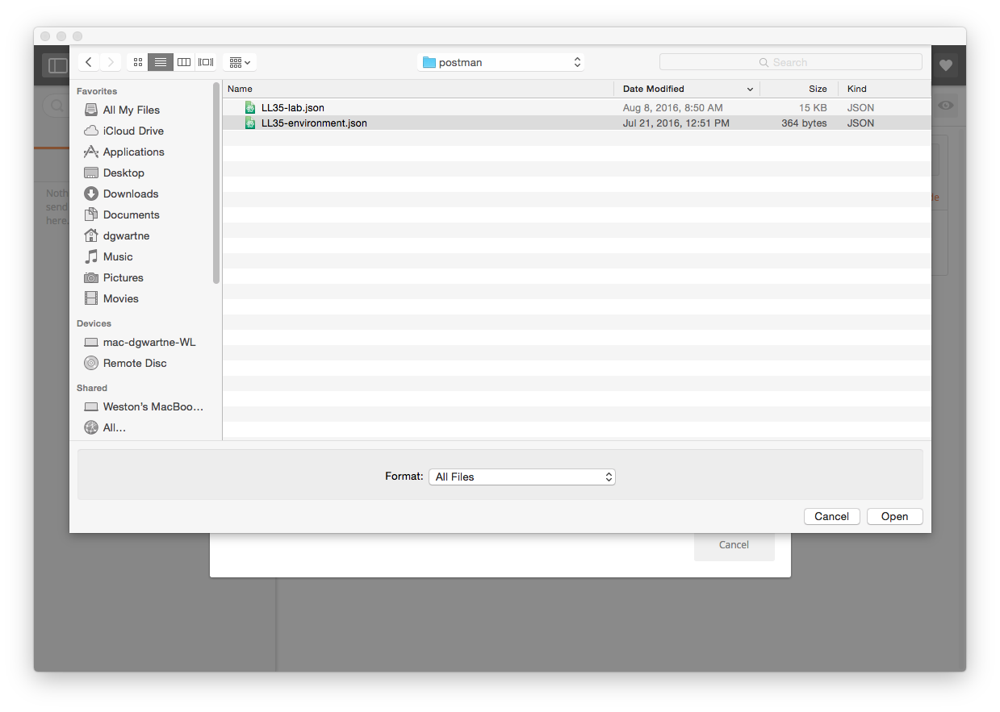

Configuring Postman Credentials Environment
-------------------------------------------

A Postman _environment_ is means to parameterize inputs when making REST calls. This next procedure will
configure an environment so that you only need to provide your credentials once.

1. Launch the Postman application if not already running.
2. Click on the drop down menu in the upper right corner labeled _No environment_ and select
_Manage Environments_.
    
3. The following pop-window is displayed:
    
4. Click on the _Import_ button.
    
5. Click on the button _Choose Files_:
    
6. Select the file `LL35-environment.json` and click the _Open_ button:
    
    