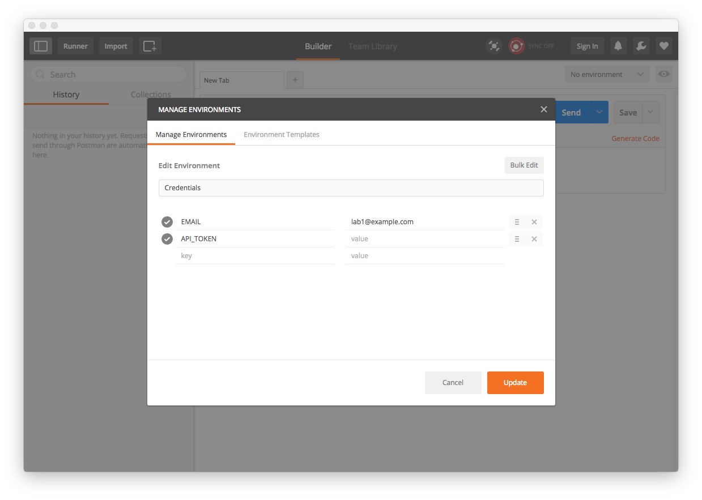
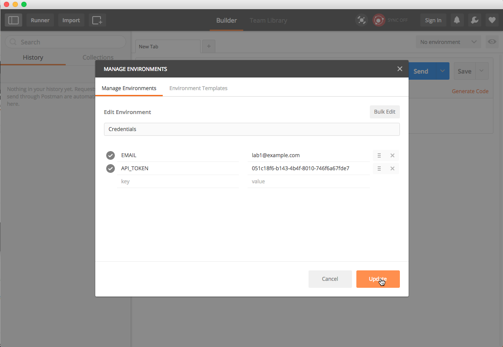
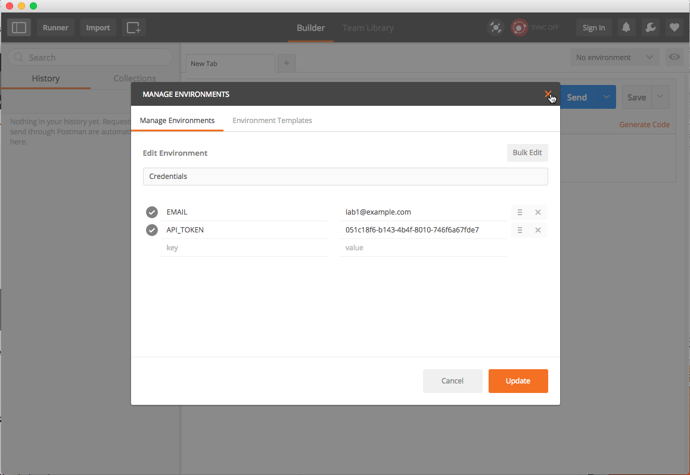
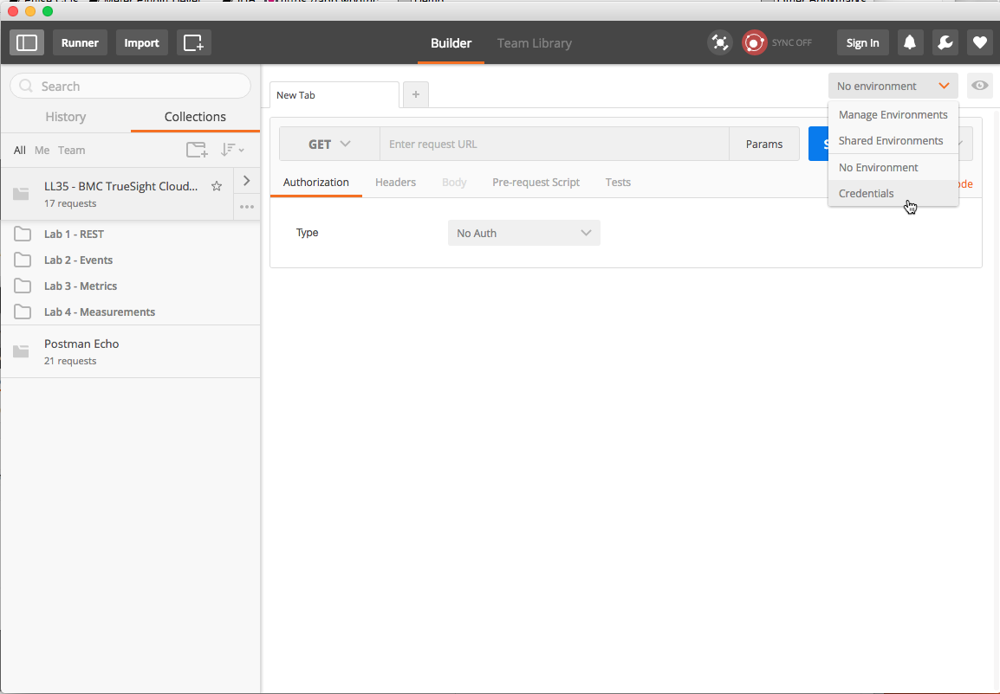

Adding Your Email and API Token
-------------------------------

1. Launch the Postman application if not already running.
2. Click on the drop down menu in the upper right corner labeled _No environment_ and select
the item labeled _Manage Environments_:
    
3. Click on the item labeled _Credentials_.
4. Next to the _EMAIL_ type the e-mail for your account:
    
5. Next to the _API_TOKEN_ type the API Token for your account:
    
6. Click on the _Update_ button to save your e-mail and API token.
    
7. Dismiss the _Manage Environments_ dialog by clicking on the X in the upper right.
    
8. Select the _Credentials_ environment by selecting _Credentials_ in the upper right drop down menu.
    
