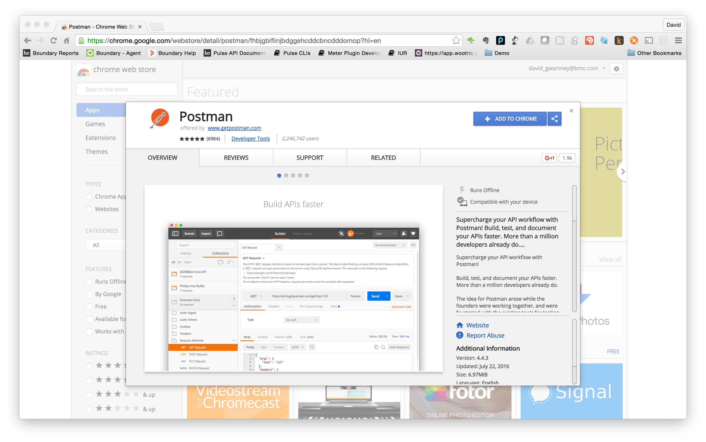
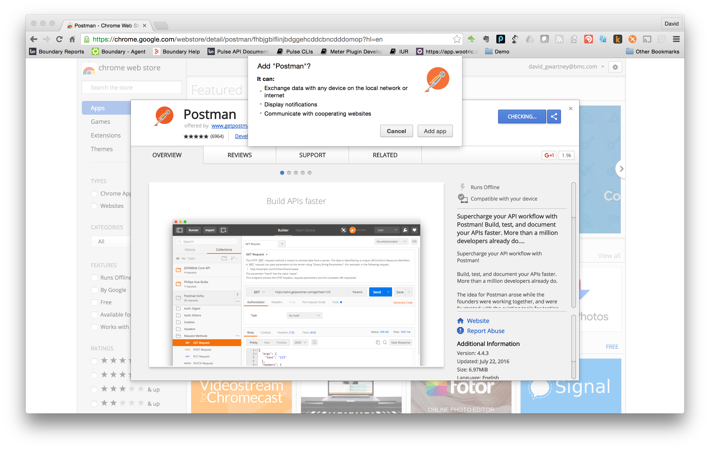
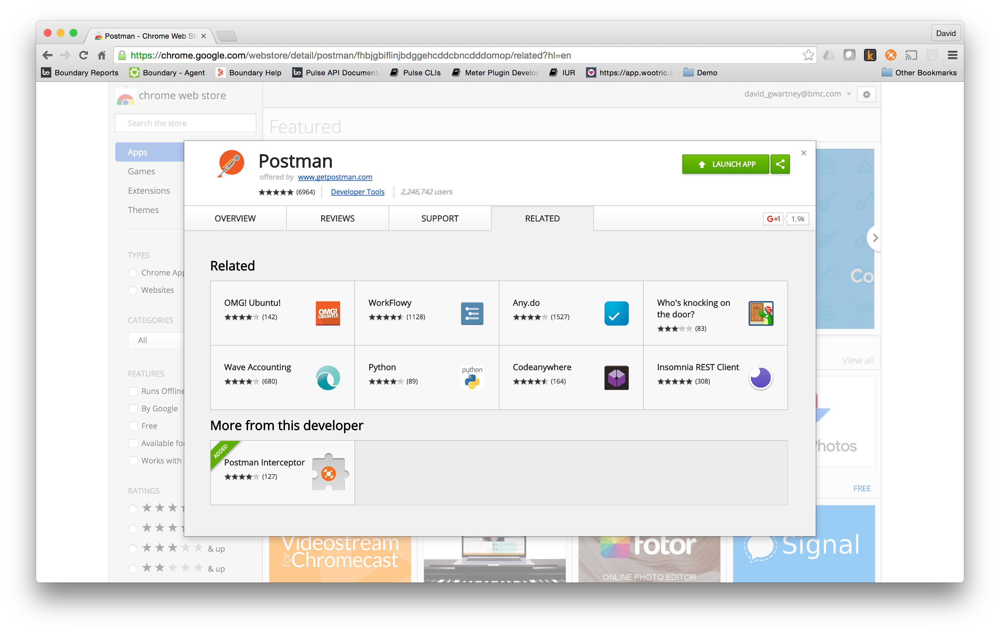
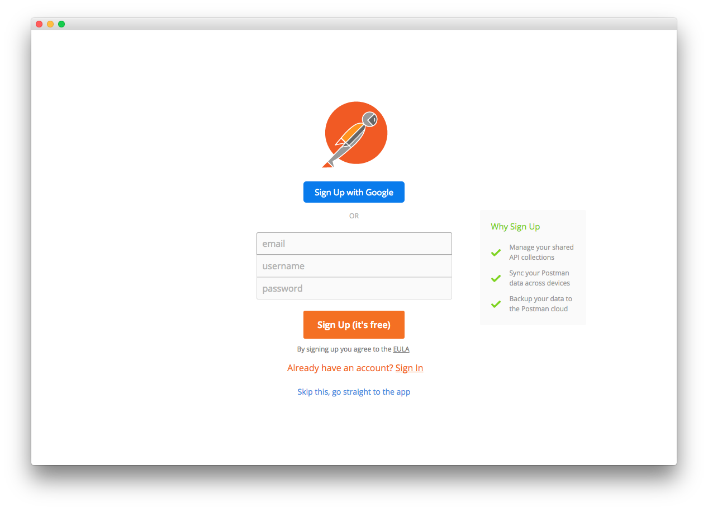
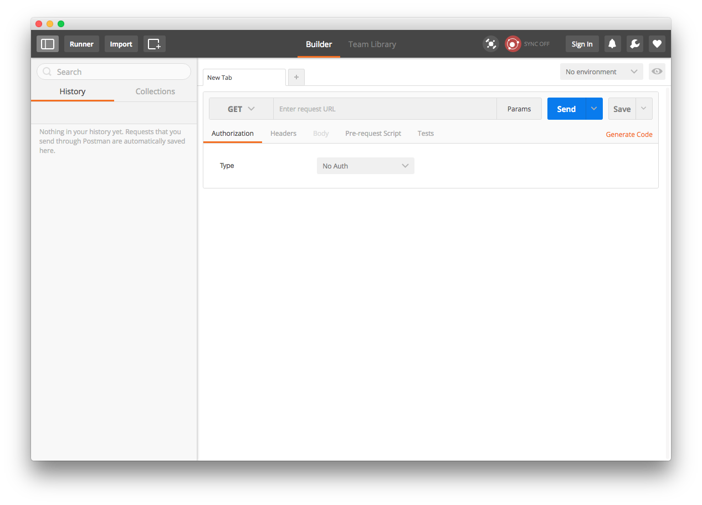

Postman Chrome Application Installation
---------------------------------------

1. Launch Chrome browser
2. Install Postman by clicking on or cutting and pasting the following link in your Chrome browswer: [https://chrome.google.com/webstore/detail/postman/fhbjgbiflinjbdggehcddcbncdddomop?hl=en](https://chrome.google.com/webstore/detail/postman/fhbjgbiflinjbdggehcddcbncdddomop?hl=en)
    
3. Click on the button labeled, _+ ADD TO CHROME_, to install the Postman Chrome application.
4. In the pop-up dialog click on the button labeled, _Add app_.
    
5. Installation of Postman is then complete:
    
6. Bypass signing up for an account by clicking the link _Skip this, go straight to the app_.
    
7. Which displays the Postman Chrome application:
    