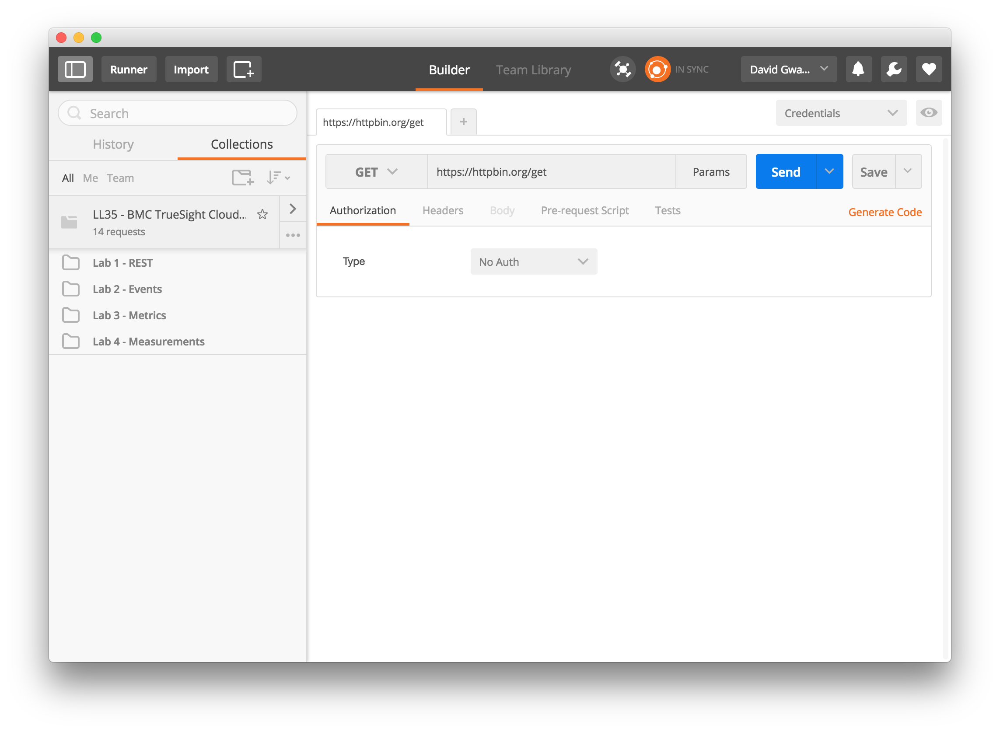

Importing Lab Exercises
-----------------------

1. Launch Chrome Browser
2. Type the following URI into the browser address bar: `chrome://apps`.
3. Click on the Postman icon as shown here:
    
4. Click on the _Import_ button which displays a pop-up window:
    
5. Which displays a pop-up window:
    
6. Click on the _Import From Link_:
    
7. Cut and paste this [link](https://raw.githubusercontent.com/BMCTrueSight/api-lab/master/postman/LL35-lab.json) into the URL field
    
8. Click the _Import_ button to load the collection.
    
    