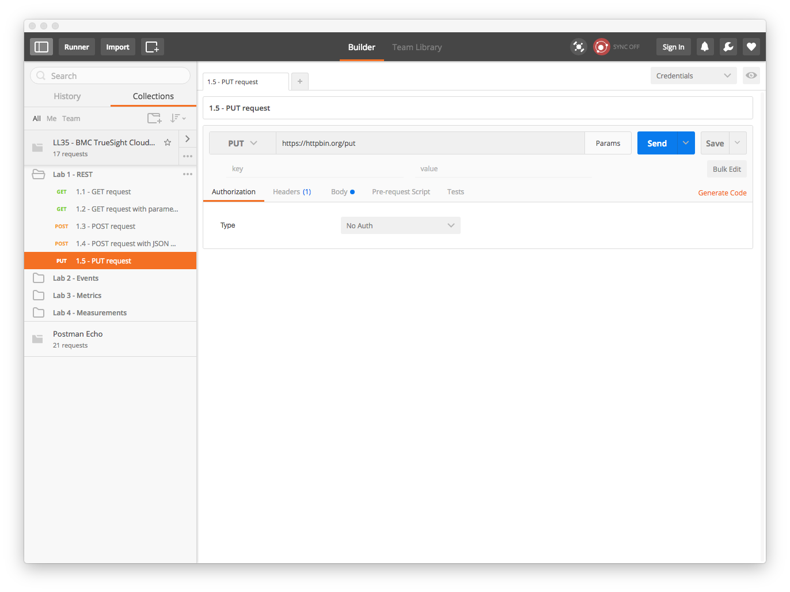

Lab 1 - API and REST Overview
=============================

Provides a brief tutorial on ReST and an introduction to the TrueSight Intelligence APIs

Agenda
------
- Overview slides of REST
- Live demo httpbin.org
- Postman Setup
- Run Labs
- Overview slides of API

Postman Installation and Configuration
--------------------------------------

This lab and proceeding labs use the PostMan Chrome plugin for executing REST commands.

The chrome plugin and the lab material are required to be loaded to complete any of the labs.

### Installation

1. Launch Chrome Browser
2. Install Postman [here](https://chrome.google.com/webstore/detail/postman/fhbjgbiflinjbdggehcddcbncdddomop?hl=en)

### Importing Lab Exercises

1. Launch Chrome Browser
2. Type the following URI into the browser address bar: `chrome://apps`.
3. Click on the Postman icon as shown here:

    

4. Click on the _Import_ button:

    
    
5. Click on the _Import From Link_:

    
    
6. Cut and paste this [link](https://raw.githubusercontent.com/BMCTrueSight/api-lab/master/postman/LL35-lab.json) into the URL field

    
    
7. Click the _Import_ button to load the collection.

    
    
    

Lab Exercises
-------------

Following exercises provide practical experiencing working with REST APIs
by executing rest calls against the [HTTP Bin Service](https://httpbin.org/).

### Getting Started

To complete these labs you need to have previously installed [PostMan]() and
loaded the lab API collection. See previous section _Postman Installation and Configuration_
for completing this task.

The interactive labs for this section are in the folder 
labeled _Lab 1 - REST_. Click on the folder to view the contents
and start the labs below.

### Exercise 1.1 - GET request

In this exercise we will issue a simple _GET_ request to familiarize ourselves with
the simplest form of a REST call.

1. Click on _1.1 GET request_ in the _Lab 1 - REST_ folder:

    
    
2. Observe the selected method is _GET_ and next to it is the
[URL](https://en.wikipedia.org/wiki/Uniform_Resource_Locator). The URL in this example starts with `https`
which is the _scheme_ which indicates the HTTP protocol over secure communication or
[HTTPS](https://en.wikipedia.org/wiki/HTTPS). This is followed by the _hostname_ in which this case is `httpbin.org`.
Lastly there is the _path_ which designates a specific _resource_.
    
3. Click on _Send_ button to initiate the call.

    

4. Observed the returned body which contains a [JSON](https://en.wikipedia.org/wiki/JSON) document
which contains the headers and the url sent in the original request.

5. You can observe the same request using other tools and programming languages by clicking on the
_Generate Code_ link in the upper right. For example here is the code snippet to execute the same
request using the [curl](https://en.wikipedia.org/wiki/CURL) utility:

    

### Exercise 1.2 - GET request with parameters

In this exercise we will observe how to send additional parameters to a _GET_ request. These additional
parameters are know as _query parameters_.

1. Click on _1.2 GET request with parameters_ in the _Lab 1 - REST_ folder:

    
    
2. Click on the _Params_ button located next to the URL:

    
    
3. For this example the are two parameters `foo` and `color` with values of `bar` and `red` respectively.
These parameters are appended to the URL path which is displayed in URL field next to the method (_GET_ in this
example). The separator between the URL path and the initial parameter is the `?`, subsequent parameters are followed
by the ampersand (`&`). Values are assigned to the parameters by equals (`=`)

4. Click on _Send_ button:

    
    
5. As in the previous exercise a JSON document is returned in the body of the response. The type of information
returned in the body is described in an HTTP header that is sent with the response of the REST call. You can observe
the headers in the response by clicking on the _Headers_ column to the right of the _Body_ column in the output
window:

    
    
6. The header labeled, _Content-Type_ indicates the type of the contents returned in the body and in this specific
case the contents are `application/json`. The various types returned in the Content-Type header are the well known
[_MIME Types_](https://en.wikipedia.org/wiki/MIME) or **Multipurpose Internet Mail Extensions** types and are
governed by Internet standards. The current list of which can be found
[here](http://www.iana.org/assignments/media-types/media-types.xhtml). NOTE: For all the lab examples in
this course the returned type will be `application\json`.

### Exercise 1.3 - POST requests

In the previous exercises we used the `GET` method to return information about resource designated by URL. In
this exercise we will use the `POST` method which is typically used to create a new resource designated by the path.

1. Click on _1.3_ in the _Lab 1 - REST_ folder:

    
    
2. Observe that the method selected for the this exercise is `POST`.
    
3. Click on the _Send_ button to execute the `POST` method:

    
    
4. Observe the resulting JSON document that is returned.

### Exercise 1.4 - POST request with JSON payload

In this exercise we are again going to issue a REST call with a `POST` method but
this time will include a JSON document that will be used to create the resource.

1. Click on _1.4 POST request with JSON payload_ in the _Lab 1 - REST_ folder:

    
    
2. Click on the _body_ column to see the JSON document to be sent with the request:

    
    
3. To indicate the type of the content being sent in the request body, we need to configure a
request header similar to that what was returned in previous requests to indicate a JSON document is returned in
the content body. Click on the _header_ column to show the request header that indicates the content of the body:

    
    
4. Click on _Send_ button to issue the `POST` request

    
    
5. Observe the JSON document returned, note the `data` field contains the original JSON document that was sent
in the `POST`.

### Exercise 1.5 - PUT request

We wrap up this initial lab to familiarizing ourself with REST by sending a REST call with a `PUT` method. In
basic terms a `PUT` call be described as a way to update a resource. This method is similar to a `POST` in the sense
that typically we send content in the body to affect the resource: the `POST` method is for its creation, and the `PUT`
method is for update.

1. Click on _1.5 PUT request_ in the _Lab 1 - REST_ folder:

    
    
2. Click on the _body_ column to view the JSON document that will be used to update the resource:

    
    
3. Observe that the content has been marked as _raw_ with its MIME type specified as `application/json`.

4. Click on the _header_ column to see that the `Content-Type` header has been set to `application/json`:

    

5. Click on _Send_ button to issue the request:

    
    
6. Again the body of our request is returned in the `data` field of the JSON document returned in the request.

### Lab 1 Summary

This concludes our initial hands on work on issuing REST commands using Postman. In this lab we learned how to:

- Get a resource with or without query parameters which typically is used to view a resource.
- Post a resource with and without content which typically creates a resource.
- Put a resource with content which typically updates a resource.

