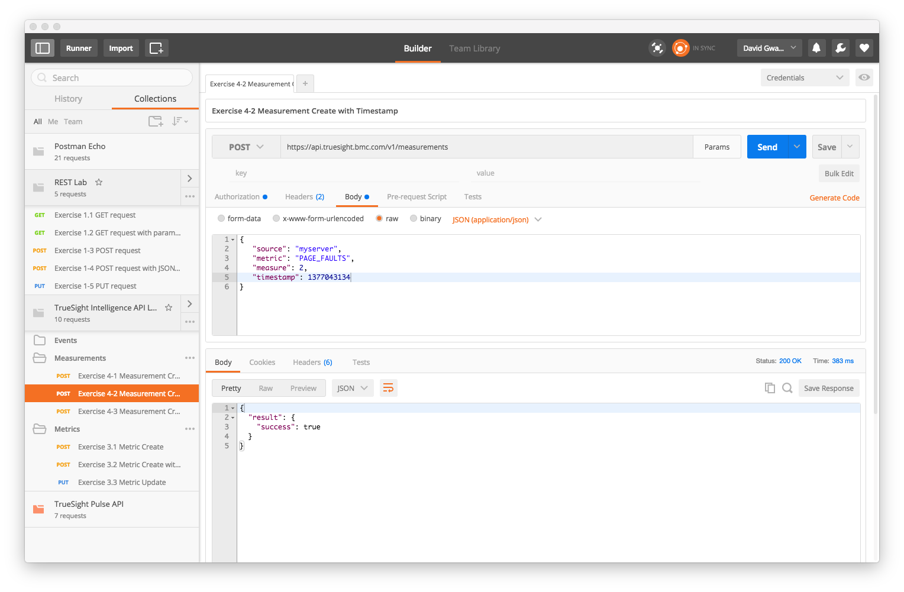
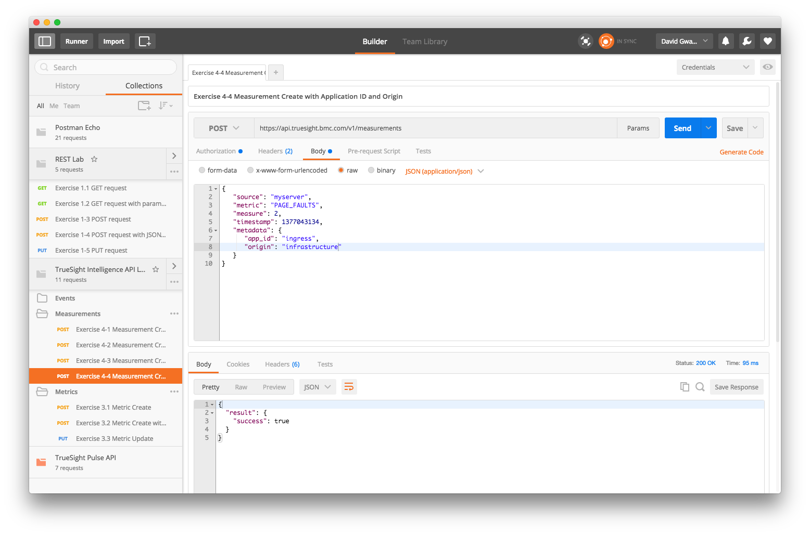

Lab 3 - Measurement API
=======================

Agenda
------
- Overview slides of Measurement API
- Run Labs

Lab Exercises
-------------

### Exercise 4.1 - Measurement Create

1. Click on _Exercise 2.1_
2. Click on _Send_ button

### Exercise 4.2 - Measurement Create with Application Id

1. Click on _Exercise 4.2_
2. Click on _Send_ button

### Exercise 4.3 - Measurement Create with Application Id and Origin

1. Click on _Exercise 4.3_
2. Click on _Send_ button

### Exercise 4.4 - Continously Send Measurements

1. Click on _Exercise 4.4_
2. Click on _Send_ button

