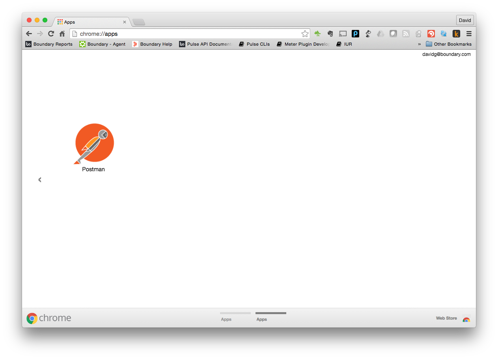
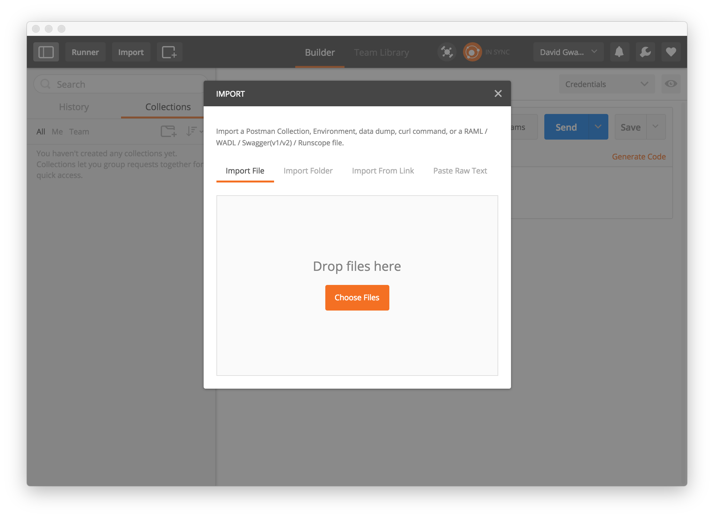
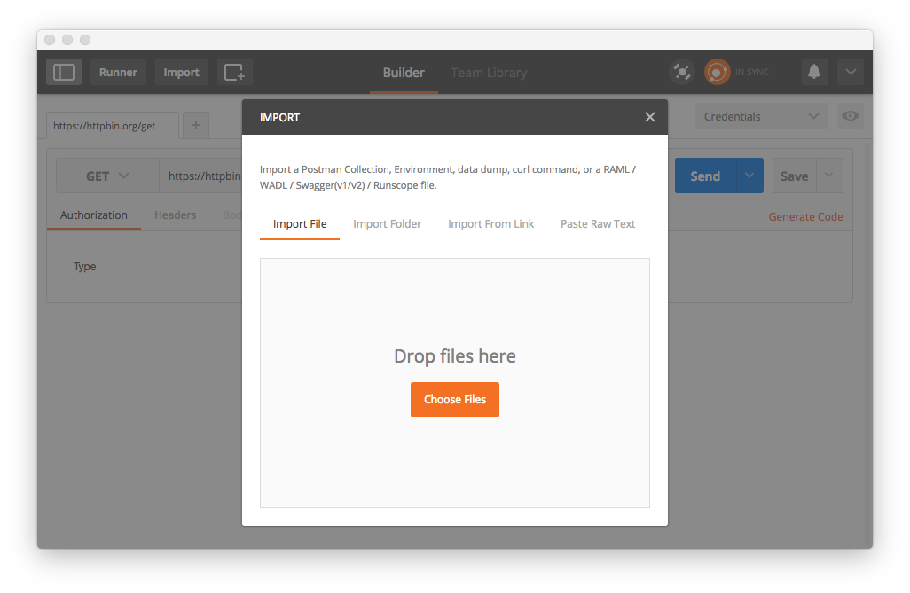
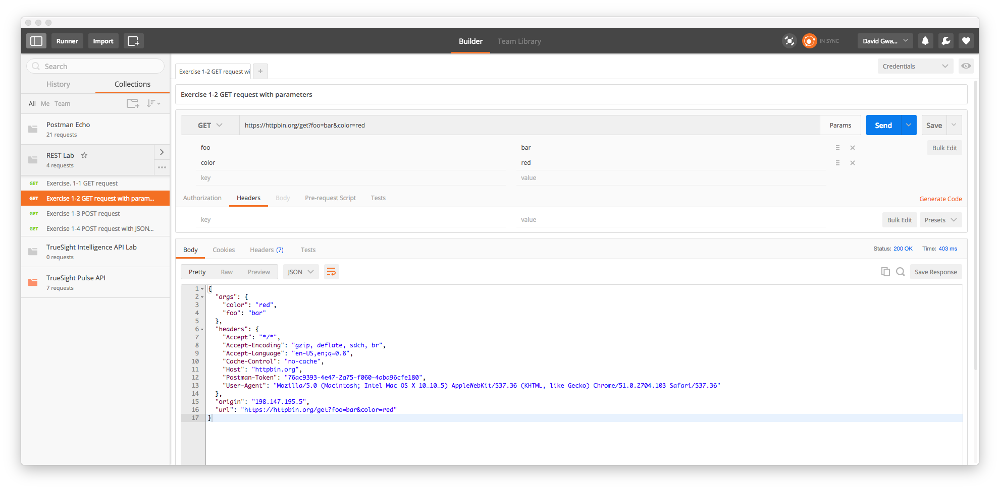
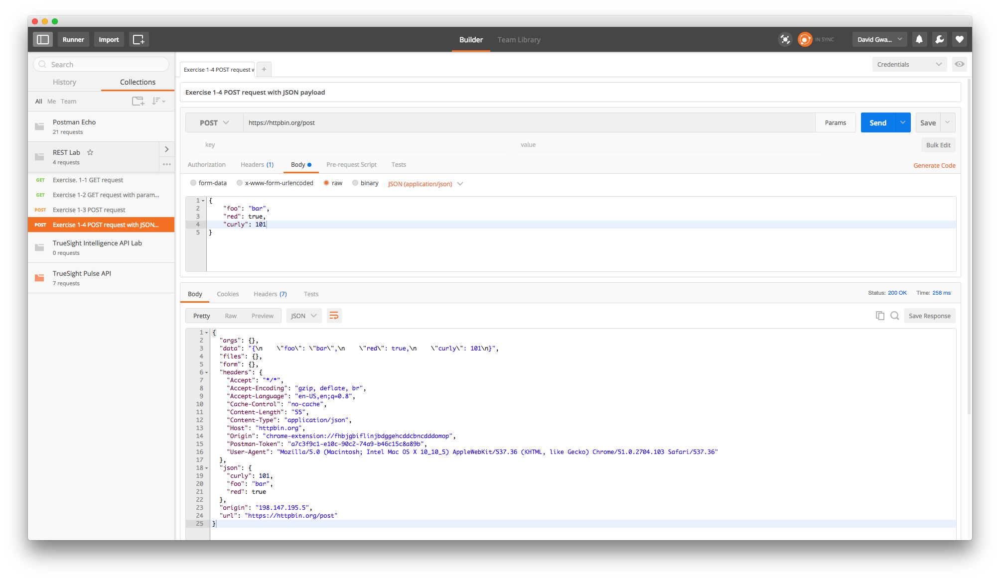
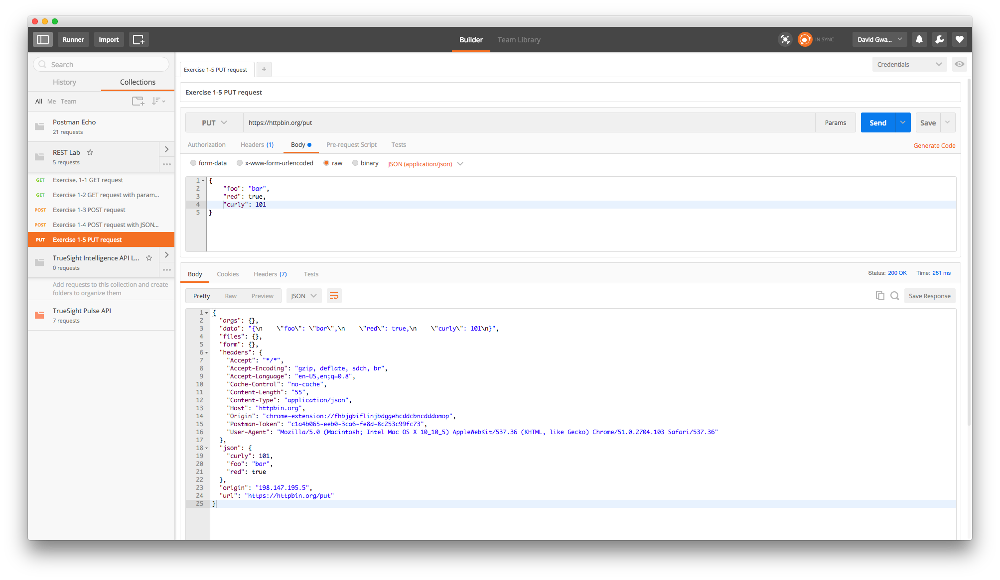

Lab 1 - API and REST Overview
=============================

Provides a brief tutorial on ReST and an introduction to the TrueSight Intelligence APIs

Agenda
------
- Overview slides of REST
- Live demo httpbin.org
- Postman Setup
- Run Labs
- Overview slides of API

Postman Installation and Configuration
--------------------------------------

This lab and proceeding labs use the PostMan Chrome plugin for executing REST commands.

The chrome plugin and the lab material are required to be loaded to complete any of the labs.

### Installation

1. Launch Chrome Browser
2. Install Postman [here](https://chrome.google.com/webstore/detail/postman/fhbjgbiflinjbdggehcddcbncdddomop?hl=en)

### Importing Lab Exercises

1. Launch Chrome Browser
2. Type the following URI into the browser address bar: `chrome://apps`.
3. Click on the Postman icon as shown here:

    

4. Click on the _Import_ button:

    
    
5. Click on the _Import From Link_:

    
    
6. Cut and paste this [link](https://raw.githubusercontent.com/BMCTrueSight/api-lab/master/postman/LL35-lab.json) into the URL field

    
    
7. Click the _Import_ button to load the collection.

    
    
    

Lab Exercises
-------------

Following exercises provide practical experiencing working with REST APIs
by executing rest calls against the [HTTP Bin Service](https://httpbin.org/).

### Getting Started

To complete these labs you need to have previously installed [PostMan]() and
loaded the lab API collection. See previous section _Postman Installation and Configuration_
for completing this task.

The interactive labs for this section are in the folder 
labeled _Lab 1 - REST_. Click on the folder to view the contents
and start the labs below.

### Exercise 1.1 - GET request

In this exercise we will issue a simple _GET_ request to familiarize ourselves with
the simplest form of a REST call.

1. Click on _Exercise 1.1 GET request_

    
    
2. Observe the selected method is _GET_ and next to it is the URL.
    
3. Click on _Send_ button to initiate the call.

    

4. Observed the returned body which contains a [JSON](https://en.wikipedia.org/wiki/JSON) document
which contains the headers and the url sent in the original request.

5. You can observe the same request using other tools and programming languages by clicking on the
_Generate Code_ link in the upper right. For example here is the code snippet to execute the same
request using the [curl](https://en.wikipedia.org/wiki/CURL) utility:

    

### Exercise 1.2 - GET request with parameters

In this exercise we will observe how to send additional parameters to a _GET_ request. These additional
parameters are know as _query parameters_.

1. Click on _Exercise 1.2 GET request with parameters_:

    
    
2. Click on the _Params_ button located next to the URL
    
2. Click on _Send_ button

    

### Exercise 1.3 - POST requests
1. Click on _Exercise 1.3_
2. Click on _Send_ button

### Exercise 1.4 - POST request with JSON payload
1. Click on _Exercise 1.4_
2. Click on _Send_ button

### Exercise 1.5 - PUT request
1. Click on _Exercise 1.5_
2. Click on _Send_ button

